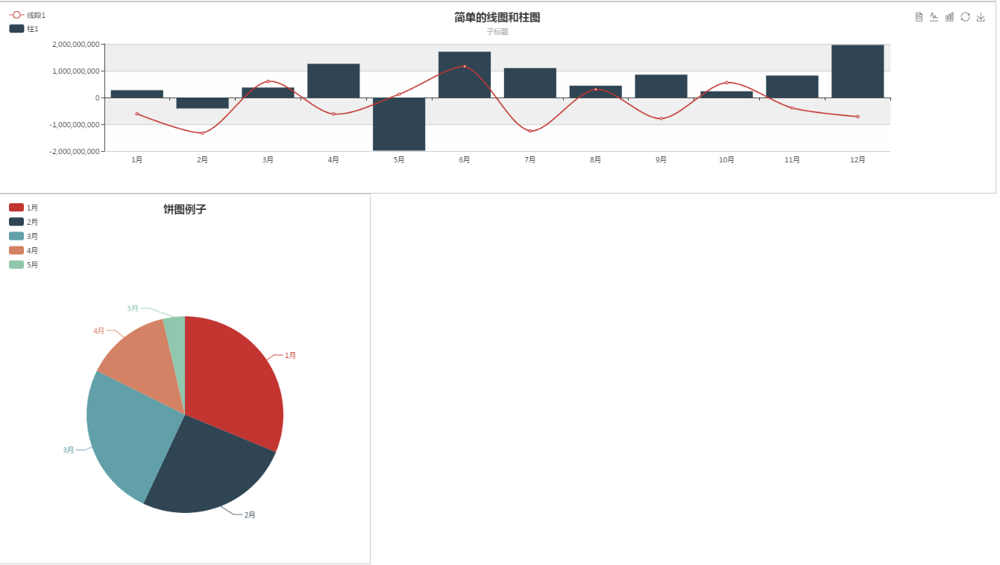

# SpringBootEChart
百度echart3的柱图和饼图的简单封装。
以springboot运行工程，打开 http://127.0.0.1:9002/ 访问

## 例子
java
```
	@RequestMapping("/lineAndBar")
	public ECharData lineAndBar() {

		BaiduEChartUtil util = new BaiduEChartUtil();

		util.setTitle("简单的线图和柱图");
		util.setSubTitle("子标题");

		// X轴
		util.setXData(getXAxis(DATA_COUNT));

		// 数据
		util.addLine("线段1", createData(DATA_COUNT));
		util.addBar("柱1", createData(DATA_COUNT));

		return util.getData();
	}

	@RequestMapping("/pie")
	public ECharData pie() {

		BaiduEChartUtil util = new BaiduEChartUtil();

		util.setTitle("饼图例子");

		// 数据
		util.addPie("提示文字", createMapData(5));

		return util.getData();
	}

	private List<Integer> createData(int count) {
		List<Integer> data = new ArrayList<>();

		for (int j = 0; j < count; j++) {
			data.add(new Random().nextInt());
		}
		return data;
	}

	private List<String> getXAxis(int count) {
		List<String> list = new ArrayList<>();
		for (int j = 1; j <= count; j++) {
			list.add(j + "月");
		}

		return list;
	}

	/**
	 * 构建饼图的数据
	 * 
	 * @param count
	 * @return
	 */
	private LinkedHashMap<String, Float> createMapData(int count) {
		LinkedHashMap<String, Float> result = new LinkedHashMap<>(count);

		for (int j = 1; j <= count; j++) {
			result.put(j + "月", new Random().nextFloat());
		}

		return result;
	}
```

js
```
<script src="jquery-1.6.1.min.js"></script>

<script src="echart/echarts.min.js"></script>
<script src="echart/drawchart.js"></script>

var chart3 = drawChart("main3", "/echart/lineAndBar");
```

